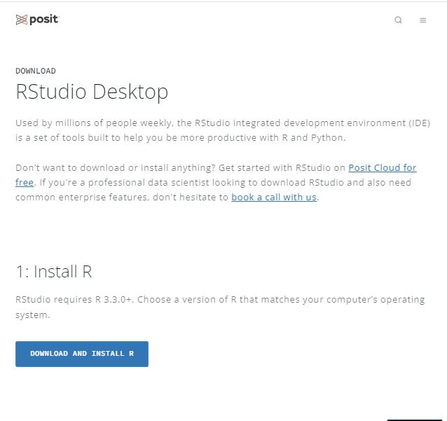
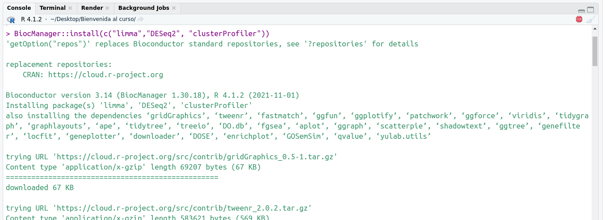

```{r setup, include=FALSE}
knitr::opts_chunk$set(echo = TRUE)
#pagedown::chrome_print("Bienvenida_al_curso.html", output = "curso.pdf")
```

# Bienvenida a la IV edición del curso de Bioinformática del CIBEREHD

En este curso presentaremos *R* y *RStudio* como herramientas para el análisis de datos. R es un lenguaje de programación especialmente diseñado para el análisis estadístico de datos y creación de gráficos. RStudio es un entorno de desarrollo integrado (IDE) para R, que permite utilizarlo de una manera más cómoda y eficaz.

Antes de empezar el curso, te recomendamos que instales R y RStudio en tu ordenador. Hazlo con tiempo, y si tienes problemas al hacerlo, ponte en contacto con nosotras con antelación.

## Instalación de R y RStudio en vuestro ordenador

El lenguaje R se puede descargar del siguiente enlace: <https://cran.rediris.es>. Tendréis que elegir la que conviene según vuestro sistema operativo.

RStudio se puede descargar de manera gratuita (_Free_) de: <https://posit.co/download/rstudio-desktop/>. La misma página detectará tu sistema operativo y te recomendará un instalador (botón azul en el apartado "2: Install RStudio").

<p align="center">
  
</p>


Aquí os dejamos tres tutoriales para más ayuda según el sistema operativo de vuestro ordenador:

* Windows: <https://datacritica.org/2021/03/18/instalacion-de-r-y-rstudio-en-windows>

* Linux: <https://linuxize.com/post/how-to-install-r-on-ubuntu-20-04>

* MacOS: <https://datacritica.org/2021/03/19/instalacion-de-r-y-rstudio-en-macos>

# Organización del curso

El curso constará de tres sesiones teórico-prácticas online (6 horas) y una sesión totalmente práctica en formato asincrónico. En las sesiones online usaremos la herramienta RStudio en la nube, *Posit Cloud*, que permite el uso RStudio en la nube. Lo usaremos para hacer demostraciones y colgar los materiales que necesitéis.

## Inscribirse en Posit Cloud

Para usar Posit Cloud, id a la web <https://posit.cloud/>, y en la parte superior derecha tendréis la opción de **Sign Up**. Inscribiros al *Cloud Free*, y podréis acceder a RStudio. En breve os pasaremos un link de con el material del curso, para que podáis acceder a los materiales del curso e incluso ejecutar los códigos en la misma plataforma.

<p align="center">
  
</p>

## Paquetes de R
En este curso utilizaremos diferentes librerías (o paquetes) de R. Los paquetes continen funciones que nos permiten hacer tareas específias. Iremos instalando durante el curso los paquetes necesarios. Sin embargo, sería recomendable que instales los siguientes antes de empezar. Para hacer eso, abre RStudio una vez instalados R y RStudio, y en la parte inferior izquierda, en `console`, copia y ejecuta las siguientes líneas:

```{r, eval = F}
# Ejecuta estas líneas
install.packages(c("BiocManager", "utils", "readr", "learnr", 
                   "readxl", "ggplot2", "ggpubr", "car"))

BiocManager::install(c("limma","DESeq2", "clusterProfiler"))
```

<p align="center">
  
</p>

# Contacto
Si necesitas ayuda puedes contactarnos:

* **Marta Coronado Zamora** (<marta.coronado@csic.es>)
* **Ana Maria Corraliza Marquez** (<anacorralizamarquez@gmail.com>)