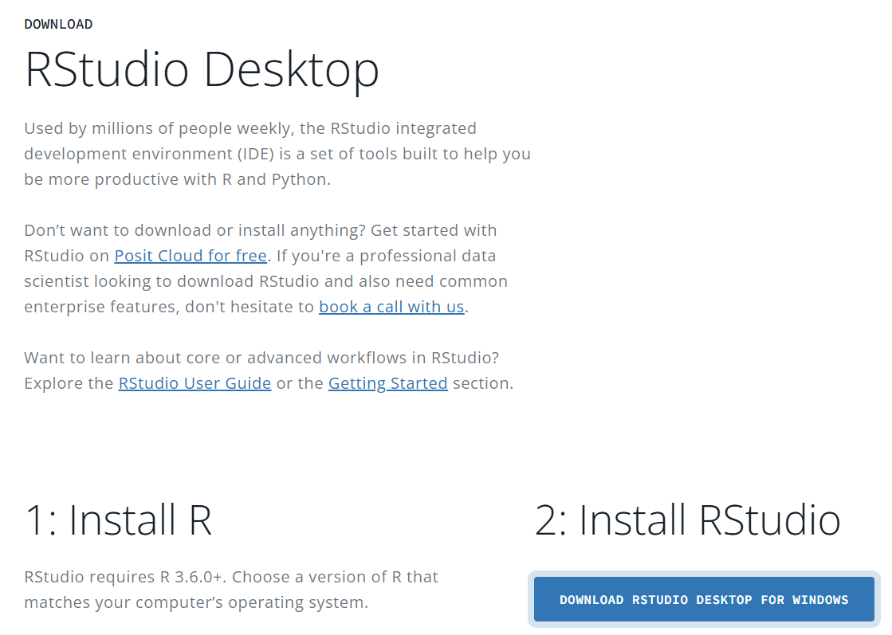

```{r setup, include=FALSE}
knitr::opts_chunk$set(echo = TRUE)
```

# Benvinguts / benvingudes

Benvinguts i benvingudes a la primera edició del curs de Bioinformàtica de la Societat Catalana de Biologia. Aquest curs d’introducció a la bioinformàtica se centra en l’ús del llenguatge R per a l’anàlisi estadística i la visualització de dades. L’objectiu és que els participants adquireixin una base sòlida en aquest llenguatge de codi obert, àmpliament utilitzat en la recerca biomèdica.

Es treballarà la importació i processament de dades, els tipus de dades en R i la creació de gràfics. També s’introduirà l’anàlisi de dades transcriptòmiques (RNA-seq) i l’estudi de variants en genomes vírics. S’empraran eines com R i Galaxy per recórrer tot el procés: des de les dades crues fins a la interpretació dels resultats.

El curs s’adreça a professionals de la recerca clínica i biomèdica que vulguin iniciar-se en l’anàlisi de dades amb R, amb especial èmfasi en aplicacions en virologia i transcriptòmica.

El programa inclou dues sessions teoricopràctiques en línia (4 hores en total) i una sessió pràctica en format asíncrona (4 hores). Utilitzarem RStudio, es recomana tenir-lo instal·lat localment, però aquí us donem també l'opció d'utilitzar Rstudio Cloud.

## Instal·lació de R a l'ordinador

A continuació us deixem tres enllaços perquè pugueu instal·lar **R** segons el sistema operatiu del vostre ordinador:

- **Windows**: [https://cran.r-project.org/bin/windows/base/](https://cran.r-project.org/bin/windows/base/)
- **Linux**: [https://linuxize.com/post/how-to-install-r-on-ubuntu-20-04/](https://linuxize.com/post/how-to-install-r-on-ubuntu-20-04/)
- **macOS**: [https://datacritica.org/2021/03/19/instalacion-de-r-y-rstudio-en-macos/](https://datacritica.org/2021/03/19/instalacion-de-r-y-rstudio-en-macos/)

## Instal·lació de RStudio

Recordeu instal·lar la versió **gratuïta per a escriptori**:  
[https://posit.co/download/rstudio-desktop/#download](https://posit.co/download/rstudio-desktop/#download)

La mateixa pàgina detectarà automàticament el vostre sistema operatiu i us recomanarà el fitxer d’instal·lació corresponent. En qualsevol cas, també trobareu més avall els enllaços per descarregar RStudio per a altres sistemes operatius.

\center {width="70%" height="70%"}
\raggedright

##  Paquets

Els paquets que utilitzarem s’aniran instal·lant al llarg del curs. Tot i això, seria recomanable tenir-ne alguns preparats abans de començar.

Per fer-ho, obriu **RStudio** un cop instal·lat i, a la pestanya `Console`, situada a la part inferior esquerra, enganxeu les línies següents:

```{r, eval = F}
install.packages(c(
  "dplyr", "ggplot2", "ggpubr", "readr", "gtsummary", "tidyverse",
  "janitor", "lubridate", "tidyr", "ggsignif", "rstatix", 
  "tibble", "viridis", "BiocManager", "utils", "learnr", "readxl", "car"
))

BiocManager::install(c("limma", "DESeq2", "clusterProfiler"))
```

## RStudio Cloud:

**RStudio Cloud** és una alternativa a la instal·lació de RStudio en el vostre ordinador. Es tracta d'una plataforma en línia que permet utilitzar RStudio des del navegador.

Per crear un compte, aneu al web oficial: [https://posit.cloud/](https://posit.cloud/). Un cop a la pàgina, cliqueu l’opció **Sign Up**, que trobareu a la part superior dreta. Se us demanarà crear un compte nou o iniciar sessió amb un compte de Google, GitHub o d’altres opcions.

Seleccioneu el pla **Cloud Free**, que és gratuït i suficient per a les activitats del curs. Un cop registrats, podreu accedir directament a l’entorn de treball de RStudio al núvol, des d’on farem totes les pràctiques.

És recomanable familiaritzar-vos amb l’entorn abans de l’inici del curs, per tal d’assegurar que podeu accedir-hi sense problemes tècnics.

\center 

\raggedright
